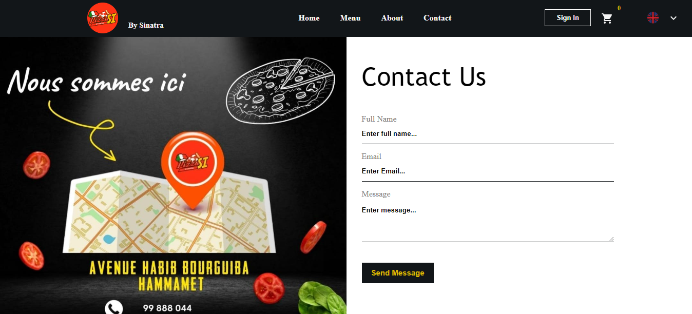
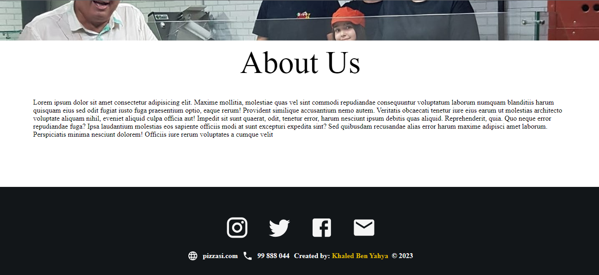

# Pizza Ordering Site

## Table of Contents

- [Overview](#overview)
- [About the Project ](#about-the-final-project-assessment)
- [Screenshot](#screenshot)
- [Links](#links)
- [My Process](#my-process)
- [Built With](#built-with)
- [Continued Development](#continued-development)
- [Useful Resources](#useful-resources)
- [Author](#author)

## Overview

This project serves as a pizza ordering web application, a solution for a local Italian restaurant that I thought it would help their business shine as much as how much their food tastes.

## About the Project

I utilized React along with various libraries to create a user-friendly pizza ordering system. The application showcases a robust user interface with intuitive design elements, prioritizing accessibility tags for better user experience. Additionally, it implements a secure payment gateway using Stripe for seamless transactions. The entire codebase is version-controlled via Git, showcasing efficient collaboration and code management practices.

## Screenshot

## Links

- Live Site URL: [Live Site](pizza-si.vercel.app/)

## My Process

Crafting this pizza ordering platform was a journey of weaving modern technologies into a seamless user experience. Fuelled by Vite and empowered by React, I sculpted an interface that blended style and functionality using CSS.

Guided by meticulous attention to detail, I orchestrated state management with Redux and Redux Persist, ensuring a consistent experience across sessions. Elevating transitions to an art form, Framer Motion added captivating animations between routes, engaging users at every click.

Enabling seamless transactions, Stripe facilitated secure online payments, fostering trust and reliability. Embracing inclusivity, the platform speaks multiple languages - English, French, and Italian - thanks to the power of i18next.

### Built With

- Framer for animation
- CSS custom properties
- React - JS library
- Redux - for state management
- Firebase - for auth
- Node js for backend support
- Stripe - for secure payments

### Continued Development

To do🔧:

- [ ] Enhance responsive design for mobile users
- [ ] Implement profile management
- [ ] Add pay on delivery feature
- [ ] Extend pizza customization features
- [ ] Add reviews from clients

### Useful Resources

- [Framer Motion Documentation](https://www.framer.com/motion/) - Resources for integrating Framer in the project.
- [Firebase Documentation](https://firebase.google.com/docs) - Resources for integrating Firebase in the project.
- [Stripe Documentation](https://stripe.com/docs/) - Guides for integrating Stripe payment system.
- [i18next Documentation](https://www.i18next.com/) - Official documentation for i18next library.

### Author

- Website: [Khaled Ben Yahya](https://khaledbenyahya.com/)
- Twitter: [@khaledbenyahya\_](https://twitter.com/khaledbenyahya_)
